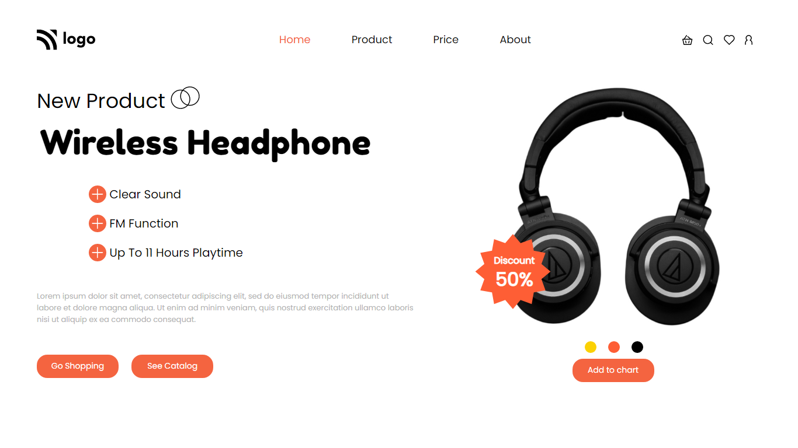

# Project 7 - Product Home Page

  

 

[DEPLOYED WEBSITE LINK](https://fsbproject7.netlify.app/)

## What I learned from this Project?

- I learned about **positions** in css (relative, absolute).
- I also learned divs alignment.

## Completed the project in **4 hours**.